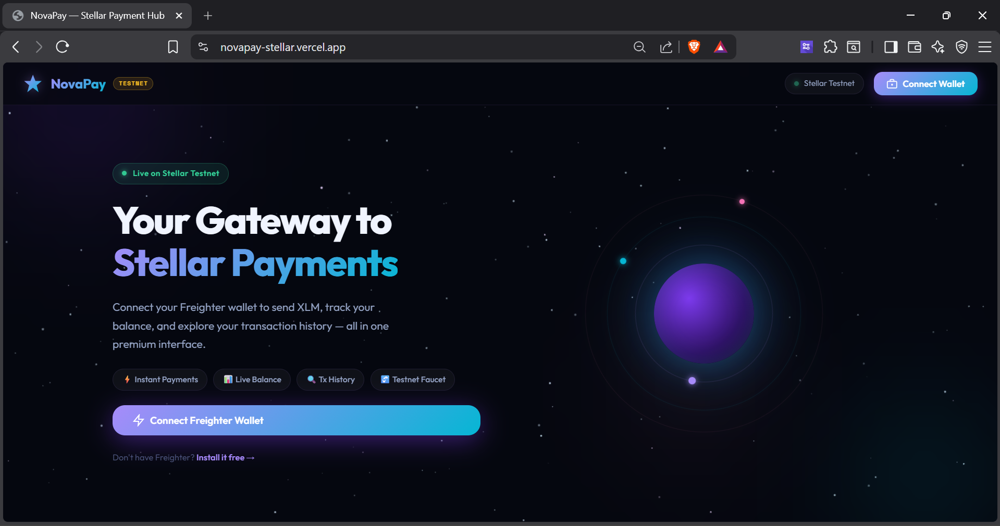
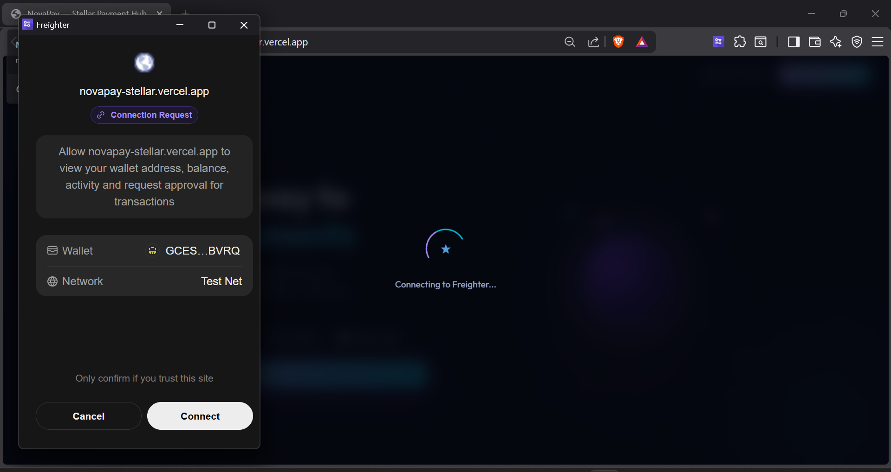
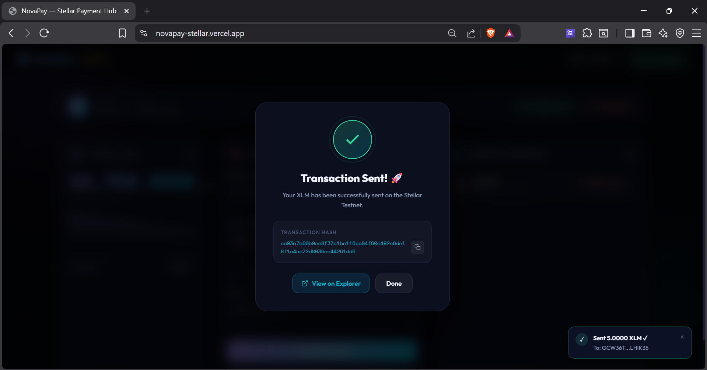
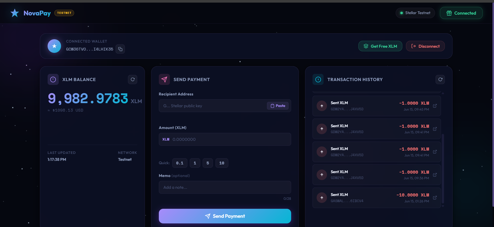
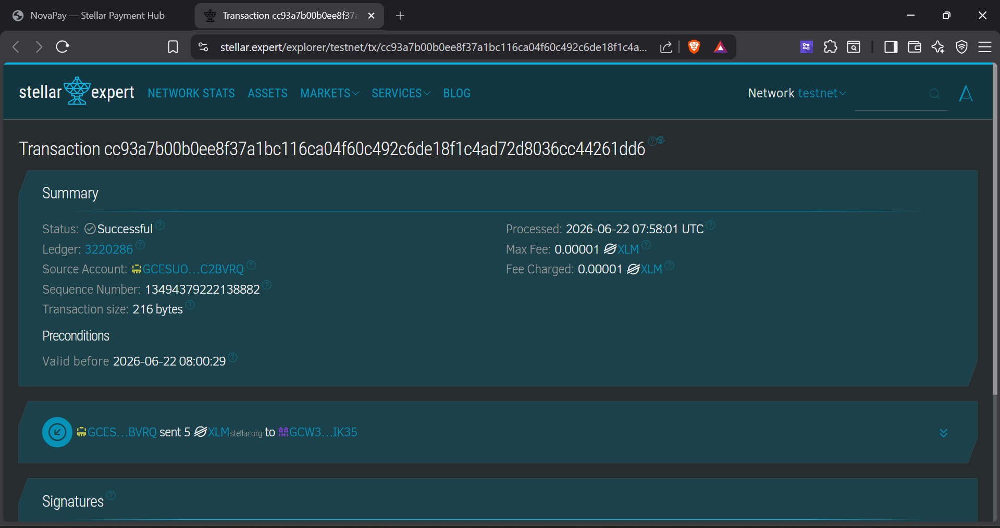

# 🚀 NovaPay — Stellar Payment Hub

> **White Belt Level 1 Submission** — A premium, space-themed Stellar dApp for the Testnet

[](https://stellar.org)
[](https://freighter.app)
[](./LICENSE)

---

## 📖 Project Description

**NovaPay** is a premium Stellar dApp built for the Stellar White Belt challenge. It provides a beautiful, feature-rich interface for interacting with the Stellar Testnet — sending XLM payments, checking live balances, exploring transaction history, and funding your account via Friendbot.

Designed with a glassmorphism dark-space aesthetic featuring:
- 🌌 Animated canvas starfield with shooting stars
- 💎 Glassmorphism cards with neon-stellar accents
- 📊 Real-time balance chart (sparkline)
- 🔔 Toast notification system with success/error/warning states
- 📱 Fully responsive mobile layout

---

## ✅ Level 1 Requirements

| Requirement | Status | Implementation |
|-------------|--------|----------------|
| Freighter Wallet Setup | ✅ | `@stellar/freighter-api` via CDN |
| Stellar Testnet | ✅ | `Networks.TESTNET` + `horizon-testnet.stellar.org` |
| Wallet Connect | ✅ | `requestAccess()` + `getPublicKey()` |
| Wallet Disconnect | ✅ | State reset + UI clear |
| XLM Balance Fetch | ✅ | Horizon `/accounts/{id}` with animated counter |
| Balance Display | ✅ | Live sparkline + USD estimate |
| Send XLM Transaction | ✅ | Full tx builder → Freighter sign → Horizon submit |
| Transaction Feedback | ✅ | Success overlay + tx hash + Explorer link |
| Error Handling | ✅ | Toast notifications for all failure states |

### 🚀 Bonus Features

- 📋 Transaction history (last 10 payments from Horizon)
- 🚰 Friendbot testnet faucet integrated
- ⚡ Quick-send presets (0.1 / 1 / 5 / 10 XLM)
- 📋 One-click copy for addresses and tx hashes
- 🔗 Every transaction links to Stellar Expert Explorer
- ✍️ Optional memo field for payment notes
- 🔄 Auto-reconnect on page refresh
- 💳 Paste address from clipboard button

---

## 🛠 Tech Stack

| Layer | Technology |
|-------|-----------|
| Core | HTML5, Vanilla CSS, ES Modules |
| Stellar | `@stellar/stellar-sdk` v12 (CDN) |
| Wallet | `@stellar/freighter-api` (browser extension) |
| Charts | Chart.js v4 (CDN) |
| Fonts | Google Fonts: Outfit + Space Grotesk + Space Mono |
| Animations | CSS keyframes + Canvas API |

---

## 🚀 Setup Instructions

### Prerequisites

1. **Install Freighter Wallet** — [freighter.app](https://freighter.app)
   - After installing, open Freighter settings and switch to **Testnet**
   - Create or import a testnet account

2. A modern browser (Chrome, Firefox, Brave, Edge)

### Running Locally

**Option A — Live Server (Recommended)**

If you have VS Code:
1. Install the [Live Server extension](https://marketplace.visualstudio.com/items?itemName=ritwickdey.LiveServer)
2. Right-click `index.html` → **Open with Live Server**
3. App opens at `http://localhost:5500`

**Option B — Python HTTP Server**

```bash
# Clone the repository
git clone https://github.com/YOUR_USERNAME/novapay-stellar.git
cd novapay-stellar

# Python 3
python -m http.server 8080
# Open http://localhost:8080
```

**Option C — Node.js `serve`**

```bash
npx serve .
# Open http://localhost:3000
```

> ⚠️ **Note:** Because the app uses ES Modules (`type="module"`), you need to serve it over HTTP, not via `file://`.

### Using the App

1. **Connect** — Click "Connect Freighter Wallet" and approve in the popup
2. **Fund** — Click "Get Free XLM" to receive 10,000 testnet XLM from Friendbot
3. **Send** — Enter a destination address and amount, click "Send Payment"
4. **Confirm** — Approve the transaction in the Freighter popup
5. **Explore** — Click any transaction hash to view it on Stellar Expert

---

## 📸 Screenshots

### 🌌 Landing Page


### 🔗 Connecting Wallet


### 💳 Wallet Connected & Balance Displayed


### 🚀 Successful Transaction (Send Payment)


### 📈 Transaction History Updated


### 🔍 Verified On-Chain (Stellar Expert)


---

## 📁 Project Structure

```
novapay/
├── index.html        # App shell — semantic HTML, accessibility-first
├── style.css         # Full design system: glassmorphism dark space theme
├── app.js            # Core logic: wallet, balance, send, history
├── particles.js      # Canvas starfield background animation
├── toast.js          # Toast notification system
├── chart-helper.js   # Chart.js balance sparkline
└── README.md         # This file
```

---

## 🔑 Key Implementation Details

### Wallet Connection (`app.js`)

```javascript
// Request Freighter access
const result = await api.requestAccess();
// Get the user's public key
const { publicKey } = await api.getPublicKey();
```

### Send Payment Transaction

```javascript
// Build transaction
const tx = new TransactionBuilder(sourceAccount, {
  fee: await server.fetchBaseFee(),
  networkPassphrase: Networks.TESTNET,
})
.addOperation(Operation.payment({
  destination, asset: Asset.native(), amount,
}))
.setTimeout(180)
.build();

// Sign via Freighter (no private key exposure!)
const { signedTxXdr } = await api.signTransaction(tx.toEnvelope().toXDR('base64'), {
  networkPassphrase: Networks.TESTNET,
});

// Submit to Horizon
const result = await server.submitTransaction(TB.fromXDR(signedXdr, Networks.TESTNET));
```

### Fetch Balance

```javascript
const account = await server.loadAccount(publicKey);
const xlm = account.balances.find(b => b.asset_type === 'native');
```

---

## 🌐 Network Configuration

| Setting | Value |
|---------|-------|
| Network | Stellar **Testnet** |
| Horizon URL | `https://horizon-testnet.stellar.org` |
| Network Passphrase | `Test SDF Network ; September 2015` |
| Explorer | [stellar.expert/explorer/testnet](https://stellar.expert/explorer/testnet) |

---

## 🔒 Security Notes

- **No private keys** are ever handled — Freighter signs all transactions
- All inputs are validated client-side before submission
- Minimum 1 XLM reserve is enforced to keep accounts active
- CORS-safe: all Stellar API calls use official public endpoints

